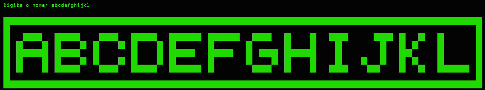

# ✨ Console Renderer ✨

[](https://opensource.org/licenses/MIT)

Uma biblioteca .NET simples, leve e poderosa para renderizar textos magníficos em arte ASCII diretamente no seu console. Transforme palavras comuns em obras de arte de matriz de pixels!



## ✨ Recursos

*   **Zero Dependências:** Leve e simples, feito em .NET puro.
*   **Fácil de Usar:** Uma única chamada de método estático (`ConsoleRenderer.Draw("...")`) para criar a mágica.
*   **Estilo Único:** Usa uma fonte de matriz 7x5 personalizada, criada com um design cuidadoso para garantir legibilidade e estilo.

## 🎨 Como Usar

Usar o `ConsoleRenderer` é incrivelmente simples e divertido.

1.  Adicione o projeto à sua solução.
2.  Chame o método `Draw()` com a string que você deseja renderizar.

```csharp
// Chame a mágica!
ConsoleRenderer.Draw("Ola Mundo!");
```

**O resultado será algo espetacular como isto:**


## 📖 O Alfabeto do `ConsoleRenderer`

Cada caractere tem uma "assinatura" única, representada por um array de 7 inteiros. Cada inteiro codifica uma linha de 5 pixels.

<details>
<summary>Clique para ver o mapa de caracteres completo!</summary>

```csharp
// Letras
{ 'A', [14, 17, 31, 17, 17] },
{ 'B', [30, 17, 30, 17, 30] },
{ 'C', [14, 17, 16, 17, 14] },
{ 'D', [30, 17, 17, 17, 30] },
{ 'E', [31, 16, 30, 16, 31] },
// ... (e todas as outras letras)...EM BREVE...

// Números

// ...EM BREVE...

// Símbolos
{ ' ', [0, 0, 0, 0, 0] },
{ '.', [0, 0, 0, 0, 4] },
{ '!', [4, 4, 4, 0, 4]},
// ... (e todos os outros símbolos)...EM BREVE...
```
</details>

## 🤝 Como Contribuir

Este é um projeto nascido da curiosidade e do amor pela programação criativa. Se você tem ideias para otimizações ou recursos, sua contribuição é mais do que bem-vinda!

1.  Faça um **Fork** deste repositório.
2.  Crie uma nova **Branch** (`git checkout -b feature/sua-feature-incrivel`).
3.  Faça o **Commit** das suas mudanças (`git commit -m 'Adiciona novo recurso...'`).
4.  Faça o **Push** para a Branch (`git push origin feature/sua-feature-incrivel`).
5.  Abra um **Pull Request**.

## 📜 Licença

Este projeto é distribuído sob a licença MIT. Veja o arquivo [LICENSE](./LICENSE) para mais detalhes.

---

Criado por **Yalê Ericssen** ([@ericssendelima](https://github.com/ericssendelima)).